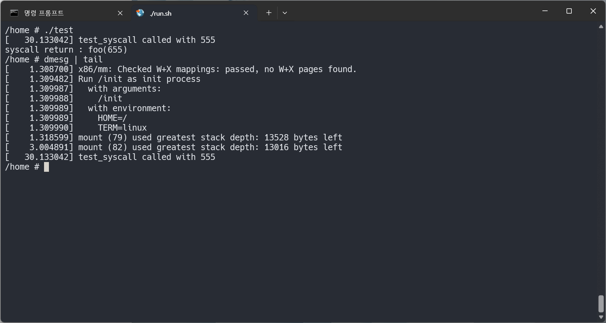

## 1.실습 내용:

    커널 소스코드에 사용자 정의 시스템콜을 추가하고, 실제 소스코드에서 시스템콜을 호출하는 실습을 진행하였다.
    1. arch/x86/entry/syscalls/syscall_64.tbl에 새 시스템콜 번호를 추가.
    2. kernel/test_syscall.c(시스템콜 동작) 코드 작성.
    3. kernel/Makefile에 obj-y += test_syscall.o를 추가하여 빌드에 소스코드를 포함.
    4. 컴파일 후 가상환경 내 유저공간에서 시스템콜을 호출.

 

## 2.결과 :

    커널 소스코드를 직접 수정하여 시스템콜을 추가하고, 이를 직접 사용자 공간에서 호출하여 사용하였다.

 

## 3.사진 :

