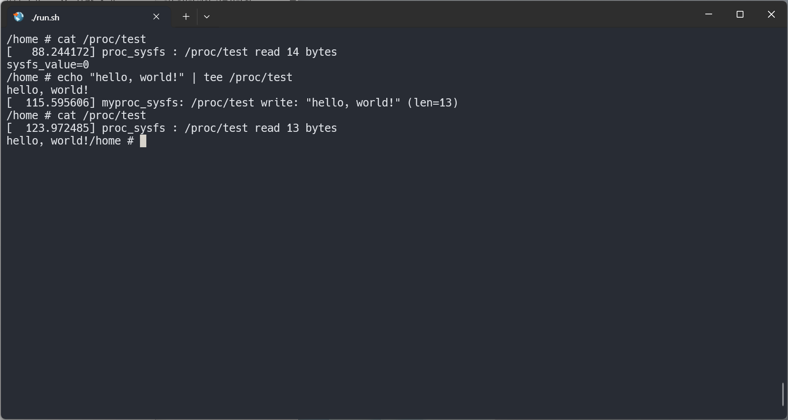
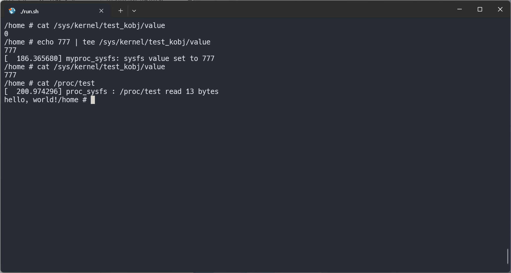

## 1.실습 내용:

    /proc/test와 /sys/kernel/test_kobj/value를 만들어 유저 공간과 커널 공간 간 인터페이스를 직접 구현하였다.    
 

## 2.결과 :

    /proc/test :
        유저가 문자열을 쓰면 커널 버퍼에 저장하고, 읽으면 저장된 문자열을 출력한다.
    
    /sys/kernel/test_kobj/value :
        유저가 읽기를 시도하면 sysfs_value 정수를 문자열로 출력하고 쓰기를 시도하면 정수가 업데이트 된다.

 

## 3.사진 :

