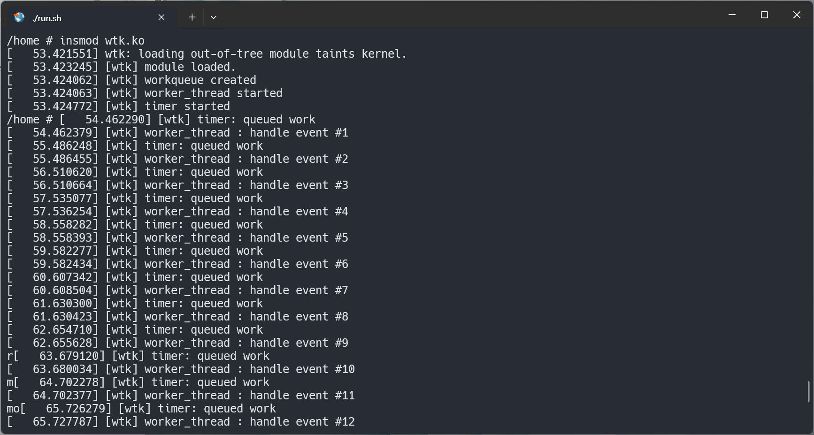
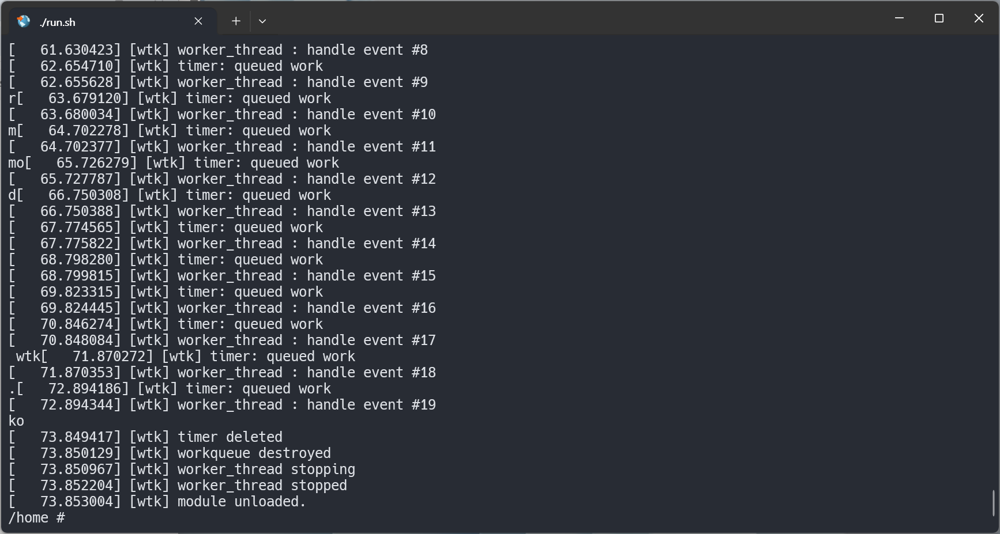

## 1.실습 내용:

    워크큐, 타이머, kthread를 조합한 실습을 진행하였다.
    
    타이머를 통해 주기적으로 워크큐에 work를 삽입하고,
    
    이벤트 플래그를 통해 kthread를 깨워서 이벤트를 처리 후 다시 수면한다.
    
---

    kthread : 이벤트가 생길 때까지 수면한다. 이벤트가 생기면 로그 출력 후 다시 수면한다.
    
    타이머 : 1초마다 콜백 호출, 타이머 콜백함수에서 work를 큐에 삽입 후 다시 1초 뒤 재등록한다.

    workqueue + work : 타이머가 삽입한 work를 실행, 이벤트 카운터 증가, kthread 깨우기를 수행한다.

 

## 2.결과 :

    1. 모듈로드 :

        - 대기큐,아토믹 초기화

        - kthread 생성

        - 워크큐 생성, work 초기화

        - 타이머 시작(1초 후 첫 만료)

    2. 1초 지날 때마다 :
        - test_timer_fn 호출
        
        - queue_work로 워크큐에 work 삽입
        
        - test_work_fn 실행, event_flag = 1, 수면 중인 워커 스레드를 깨움

        - kthread는 깨어난 후 event_flag 확인 후 event_count 증가, 로그 출력 후 event_flag 0으로 설정

    3. 모듈 언로드 :
        
        - 타이머, 워크큐(등록된 워크를 모두 처리 후), 워커 스레드(스레드 깨운 후) 종료

 

## 3.사진 :

